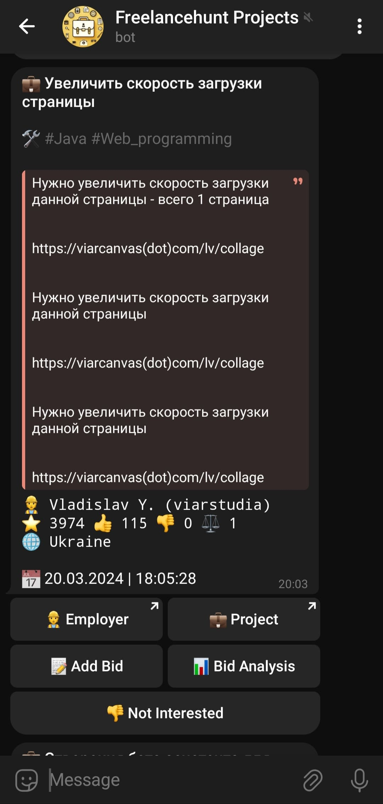
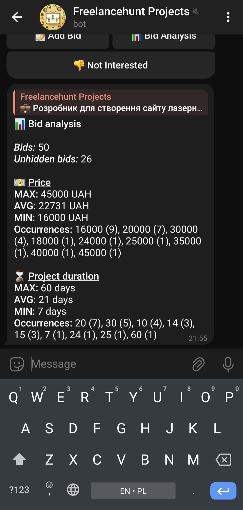
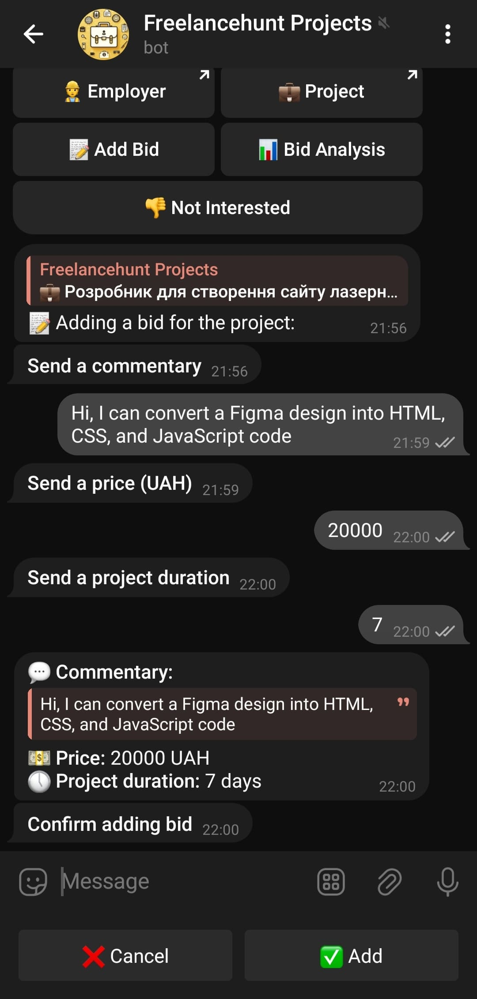

# Freelancehunt Bot

**Freelancehunt Bot** is a Telegram bot built on Node.js that leverages the [Freelancehunt API](https://apidocs.freelancehunt.com/) to fetch new projects matching specified skills and sends them directly to your Telegram chat. This bot is designed to streamline the process of finding freelance projects on Freelancehunt without the need to manually browse the website.

## Features

- **Automatic Project Fetching:** The bot continuously monitors new projects on Freelancehunt matching the specified skills.
- **Detailed Project Information:** Each project message includes the title, description, required skills, employer information (name, username, rating, country), and the publication date and time.
- **Interactive Interface:** Project messages come with buttons for easy navigation and interaction:
    - `👷 Employer` - direct link to the employer's Freelancehunt profile.
    - `💼 Project` - link to view the project details on Freelancehunt.
    - `📝 Add Bid` - allows you to place a bid on the project directly from Telegram. You can input a comment for your bid, specify the price, and project duration.
    - `📊 Bid Analysis` - provides an analysis of existing bids from other freelancers, displaying the total number of bids and the number of unhidden bids, as well as an analysis of bid prices and project durations, including maximum, average, and minimum values, along with occurrences of different price points and duration values.
    - `👎 Not Interested` - removes the project message if it's not relevant to you.

## Installation

1. Clone the repository:
     
    ```bash
    git clone https://github.com/astik-dev/freelancehunt-bot.git
    ```

2. Navigate to the project directory:

    ```bash
    cd freelancehunt-bot
    ```

3. Install dependencies:

    ```bash
    npm install
    ```

4. Create a `.env` file in the project root and fill in the required environment variables as specified in `config.js`:

    ```dotenv
    TELEGRAM_BOT_TOKEN=your_telegram_bot_token
    TELEGRAM_CHAT_ID=your_telegram_chat_id
    FREELANCEHUNT_TOKEN=your_freelancehunt_api_token
    FREELANCEHUNT_SKILL_IDS=comma_separated_skill_ids
    ```

5. Start the bot:

    ```bash
    npm start
    ```

## Usage

Once the bot is running, it will automatically fetch new projects from Freelancehunt based on the specified skills and send them to your Telegram account. You can interact with the project messages using the provided buttons to explore more details or take action.

## Screenshots

Screenshot of a typical project message sent by the bot:



Screenshot displaying the message with bid analysis:



Screenshot showing the action taken after pressing the "Add Bid" button:


